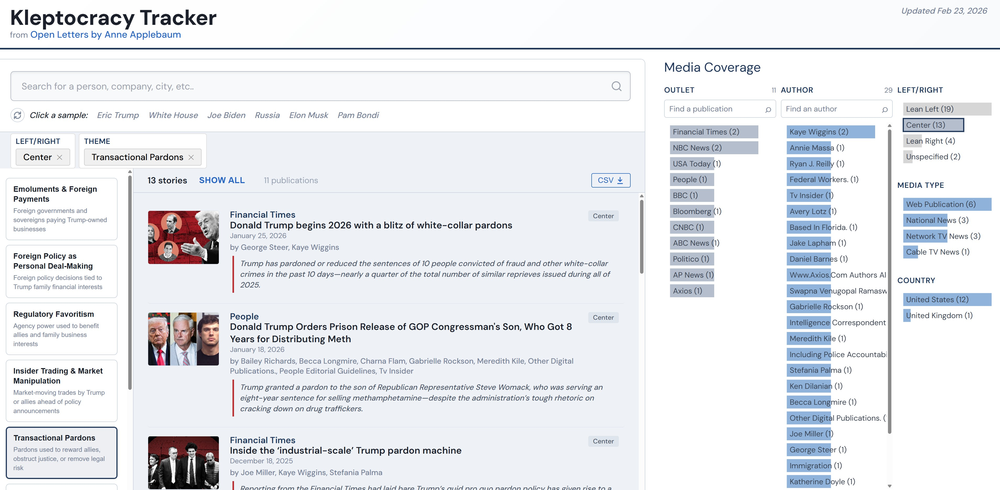

# Kleptocracy Tracker

An interactive explorer for news coverage tracked by Anne Applebaum's [Kleptocracy Tracker](https://anneapplebaum.substack.com/) from her Substack newsletter "Open Letters."

## Live Demo

**[View the Kleptocracy Tracker →](https://yourusername.github.io/kleptocracy-tracker/)**

## Features

- **Search by Entity** — Find stories mentioning specific people, companies, or places
- **Filter by Theme** — Explore stories by corruption category (emoluments, pardons, regulatory favoritism, etc.)
- **Filter by Media Outlet** — See coverage from specific publications
- **Filter by Author** — Find articles by journalist
- **Political Orientation** — Filter by media outlet's political leaning
- **Export to CSV** — Download filtered results for further analysis

## About

The Kleptocracy Tracker documents news coverage of corruption, conflicts of interest, and abuse of power. This visualization makes it easy to explore the data by filtering across multiple dimensions.

Data is sourced from Anne Applebaum's weekly tracker entries on her Substack newsletter.

## Credits

- **Data**: [Anne Applebaum](https://anneapplebaum.substack.com/) — Open Letters on Substack
- **Visualization**: Built with [D3.js](https://d3js.org/), [DC.js](https://dc-js.github.io/dc.js/), and [Crossfilter](https://crossfilter.github.io/crossfilter/)

## License

This project is for educational and research purposes. News article metadata is aggregated from Anne Applebaum's publicly available Substack posts.
